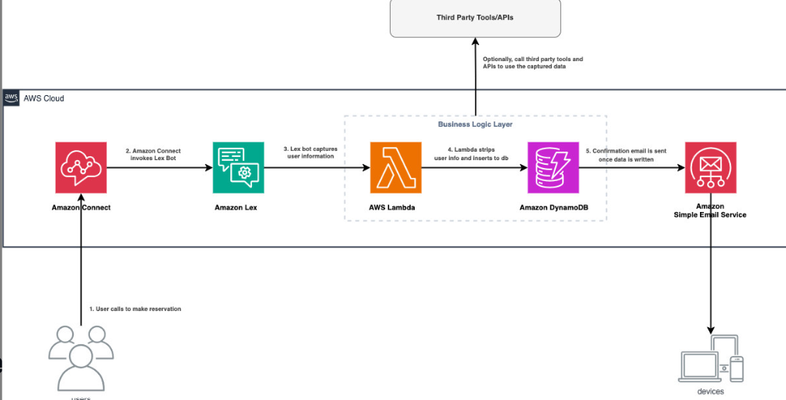

# AWS Reservation Assistant

This project sets up an AI-powered reservation assistant using AWS services and Terraform.

## Architecture


!Architecture Diagram





- **Amazon Connect**: Handles incoming calls.
- **Amazon Lex**: Manages voice interaction and captures reservation details.
- **AWS Lambda**: Processes and stores the reservation.
- **Amazon DynamoDB**: Stores reservation data.
- **Amazon SES**: Sends confirmation emails.

## Setup

1. **Clone the repository**:
    ```sh
    git clone https://github.com/sivasaileo/AI-powered-customer-service-voice-agent-on-AWS
    ```

2. **Deploy the Infrastructure**

    cd terraform
    terraform init
    terraform apply

Review the plan and confirm the changes to deploy the resources.

3. **Deploy the Lambda Function**

    cd ../lambda/process_reservation
    zip -r process_reservation.zip .
    aws lambda update-function-code --function-name ProcessReservation --zip-file fileb://process_reservation.zip


4. **Configure Amazon Connect**

    Verify the Instance and Phone Number:

    Ensure the Amazon Connect instance and phone number are created by Terraform.
    You can find the instance details in the AWS Console under Amazon Connect.
    Upload and Configure the Contact Flow:

    Navigate to the Amazon Connect console.
    Go to the contact flows section and verify the contact flow created by Terraform.
    Create a new contact flow if needed and upload the contact_flow.json file.
    Assign the contact flow to the claimed phone number:
    Go to the Phone numbers section.
    Select the phone number you claimed.
    In the Contact flow / IVR dropdown, select the contact flow you created (e.g., "ReservationFlow").
    Click Save.

5. **Configure Amazon Lex**
    Verify the Lex Bot:

    Ensure the Lex bot and intents are created by Terraform.
    You can find the bot details in the AWS Console under Amazon Lex.
    Link Lex Bot to Lambda Function:

    In the Lex bot configuration, go to the Fulfillment section.
    Verify that the Lex bot is linked to the ProcessReservation Lambda function created by Terraform.

6. **Testing and Verification**
    Test the Call Flow:

    Call the phone number assigned to Amazon Connect.
    Follow the prompts to make a reservation.
    Verify Data Storage:

    Check the DynamoDB table to ensure the reservation data is stored correctly.
    Check Email Confirmation:

    Verify that a confirmation email is sent to the provided email address.

7. **Monitor and Optimize**
    Monitor Logs and Metrics:

    Use AWS CloudWatch to monitor logs and metrics for Lambda, Lex, and Connect.
    Ensure everything is functioning as expected and troubleshoot any issues.
    Optimize and Scale:

    Based on usage and performance, optimize the configuration and scale resources as needed.

8. **Contributing**
    Feel free to fork this repository and make updates. Contributions are welcome!